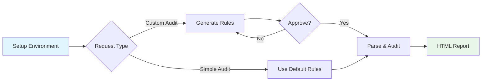

# doc-audit Agent Skill

> Intelligent document audit system for compliance review, legal and technical document verification using LLM

[](https://opensource.org/licenses/MIT)
[](https://www.python.org/downloads/)

**doc-audit** is an LLM-powered document auditing skill for Claude that automatically reviews Word documents (.docx) for compliance violations, language accuracy, technical correctness, and logical inconsistencies. Built on the [Agent Skills](https://agentskills.io/specification) specification.

## Features

- 🤖 **LLM-Powered Auditing** - Uses Google Gemini or OpenAI models for intelligent document review
- 📋 **Flexible Rule System** - Default rules plus customizable audit criteria
- 🎯 **Block-Level Precision** - Audits each heading section independently with full traceability
- 📊 **Interactive HTML Reports** - Filter, block false positives, and export actionable results
- ✏️ **Track Changes Integration** - Apply audit fixes directly to Word documents with revision tracking
- 🔄 **Iterative Workflow** - Refine rules, resume interrupted audits, and process large documents

## Quick Start

### Prerequisites

- Python 3.8+
- Google Gemini API key OR OpenAI API key
- Word documents created in Microsoft Word 2013+ (requires `w14:paraId` attributes)

### Setup

1. **Set up environment variables**:

```bash
# For Google Gemini (recommended)
export GOOGLE_API_KEY="your_api_key_here"

# OR for OpenAI (requires gpt-4o-2024-08-06+, gpt-4o-mini, or gpt-5.x)
export OPENAI_API_KEY="your_api_key_here"
```

2. **Initialize the audit environment** (first time only):

```bash
bash skills/doc-audit/scripts/setup_project_env.sh
source .claude-work/doc-audit/env.sh
```

This creates:
- `.claude-work/venv/` - Python virtual environment with all dependencies
- `.claude-work/doc-audit/` - Working directory for audit files
- `.claude-work/doc-audit/default_rules.json` - Default audit rules
- `.claude-work/doc-audit/workflow.sh` - Convenience workflow script

## Usage Examples (Claude-Code)

### Example 1: Basic Audit with Default Rules

Simply ask Claude to audit a document without specifying custom requirements:

```
Use doc-audit to review the following file: test.docx
```

**What happens:**
1. Claude uses default audit rules (grammar, typos, ambiguous references, etc.)
2. Parses document into text blocks
3. Runs LLM audit on each block
4. Generates `test_audit_report.html` in the same directory as the source file

✅ **Use when:** You want comprehensive document review with standard quality checks

---

### Example 2: Custom Rules Merged with Defaults

Ask Claude to audit for specific issues while keeping default rules:

```
Use doc-audit to check if the following file contains imprecise contract terms: contract.docx
```

**What happens:**
1. Claude generates custom rules for "imprecise contract terms" using LLM
2. Merges custom rules WITH default rules automatically
3. Presents all rules for your confirmation:
   ```
   [R001] Check for vague or ambiguous monetary amounts
   [R002] Check for unclear time specifications
   ...
   [R025] Check for imprecise payment terms
   Total: 25 rules
   ```
4. After you approve, proceeds with parse → audit → report

✅ **Use when:** You have domain-specific requirements but still want general quality checks

---

### Example 3: Custom Rules ONLY (No Defaults)

Explicitly request audit with ONLY your specific rules, excluding defaults:

```
Use doc-audit to ONLY check if the following file contains imprecise contract terms (do not include default rules): contract.docx
```

**What happens:**
1. Claude generates rules with `--no-base` flag (excludes defaults)
2. Presents ONLY your custom rules for confirmation:
   ```
   [R001] Check for imprecise payment terms
   [R002] Check for ambiguous delivery clauses
   Total: 2 rules
   ```
3. After approval, proceeds with targeted audit

✅ **Use when:** You want laser-focused audit on specific criteria without noise from other checks

---

## Workflow Overview



## Core Scripts

| Script | Purpose | Typical Usage |
|--------|---------|---------------|
| `setup_project_env.sh` | Environment setup | Run once at project start |
| `workflow.sh` | Complete audit pipeline | Recommended for most audits |
| `parse_rules.py` | Generate/refine custom rules | Claude uses automatically |
| `parse_document.py` | Extract text blocks from DOCX | Called by workflow.sh |
| `run_audit.py` | Execute LLM audit | Called by workflow.sh |
| `generate_report.py` | Create HTML report | Called by workflow.sh |
| `apply_audit_edits.py` | Apply fixes with track changes | Manual post-processing |

📖 **Detailed documentation**: See [skills/doc-audit/SKILL.md](skills/doc-audit/SKILL.md) and [skills/doc-audit/TOOLS.md](skills/doc-audit/TOOLS.md)

## Environment Variables

```bash
# ──────────────────────────────────────────────────────────
# API Keys (Required)
# ──────────────────────────────────────────────────────────
export GOOGLE_API_KEY="your_gemini_key"     # Gemini (recommended)
export OPENAI_API_KEY="your_openai_key"     # OpenAI (requires gpt-4o+ or gpt-5.x)

# ──────────────────────────────────────────────────────────
# Model Configuration (Optional)
# ──────────────────────────────────────────────────────────
export DOC_AUDIT_GEMINI_MODEL="gemini-3-flash"    # Default
export DOC_AUDIT_OPENAI_MODEL="gpt-5.2"           # Default

# ──────────────────────────────────────────────────────────
# Output Language (Optional)
# ──────────────────────────────────────────────────────────
export AUDIT_LANGUAGE="Chinese"    # Default (also: English, Japanese, etc.)
```

⚠️ **OpenAI Compatibility**: Only models supporting Structured Outputs are supported:
- ✅ `gpt-4o-2024-08-06` or later
- ✅ `gpt-4o-mini`
- ✅ `gpt-5.x` series
- ❌ Older models will cause API errors

## Project Structure

```
doc-audit/
├── LICENSE                      # MIT License
├── README.md                    # This file
├── skills/
│   └── doc-audit/
│       ├── SKILL.md             # Skill instructions for Claude
│       ├── TOOLS.md             # Detailed tool documentation
│       ├── LICENSE.txt          # MIT License
│       ├── scripts/
│       │   ├── setup_project_env.sh      # Environment initialization
│       │   ├── parse_rules.py            # LLM-based rule generation
│       │   ├── parse_document.py         # DOCX parsing (Aspose.Words)
│       │   ├── run_audit.py              # LLM audit execution
│       │   ├── generate_report.py        # HTML report generation
│       │   └── apply_audit_edits.py      # Track changes integration
│       └── assets/
│           ├── default_rules.json        # Default audit rules
│           └── report_template.html      # Jinja2 HTML template
└── .claude-work/                         # Created by setup script
    ├── venv/                             # Python virtual environment
    ├── logs/                             # Operation logs
    └── doc-audit/
        ├── env.sh                        # Environment activation
        ├── workflow.sh                   # Audit pipeline script
        ├── default_rules.json            # Default rules (copied)
        ├── report_template.html          # Template (copied)
        ├── <docname>_blocks.jsonl        # Parsed blocks (per document)
        ├── <docname>_manifest.jsonl      # Audit results (per document)
        └── <docname>_custom_rules.json   # Custom rules (optional)
```

## Key Features

### Intelligent Rule System

- **Default Rules**: 20+ pre-configured rules for grammar, clarity, consistency
- **Custom Rules**: Natural language → LLM generates structured audit criteria
- **Iterative Refinement**: Add, remove, or modify rules through conversation
- **Smart Merging**: Automatically combines custom + default rules (unless explicitly excluded)

### Robust Document Parsing

- **Heading-Based Splitting**: Each section becomes an auditable text block
- **Numbering Preservation**: Captures list labels (1.1, 1.2, etc.) via Aspose.Words
- **Table Support**: Embeds tables as JSON within text blocks
- **Stable UUIDs**: Uses Word's `w14:paraId` for reliable block identification

### Interactive Reports

- **Issue Filtering**: By severity, category, or rule ID
- **False Positive Blocking**: Mark and exclude invalid findings
- **JSONL Export**: Export non-blocked issues for programmatic processing
- **Rule Details**: View examples and explanations via modal dialogs

## Limitations

- ✅ Supports: `.docx` files (Word 2013+)
- ❌ Not supported: `.doc`, `.pdf`, `.rtf`, or other formats
- 📄 Block-level audit: No cross-section reference validation
- 🔑 Aspose.Words: Requires license for production (trial has evaluation watermark)
- 🎯 Audit quality: Depends on LLM model and rule clarity

## Advanced Usage

### Manual Workflow Control

```bash
# Step 1: Generate custom rules
python scripts/parse_rules.py \
  --input "Check for ambiguous payment terms and missing signatures" \
  --output .claude-work/doc-audit/contract_custom_rules.json

# Step 2: Review and edit rules (optional)
cat .claude-work/doc-audit/contract_custom_rules.json

# Step 3: Run complete audit pipeline
./.claude-work/doc-audit/workflow.sh contract.docx contract_custom_rules.json
```

### Resume Interrupted Audits

```bash
python scripts/run_audit.py \
  --document .claude-work/doc-audit/report_blocks.jsonl \
  --rules .claude-work/doc-audit/report_custom_rules.json \
  --resume  # Skips already-audited blocks
```

### Apply Fixes to Document

```bash
# 1. Review HTML report in browser
# 2. Mark false positives as blocked
# 3. Export to JSONL
# 4. Apply edits with track changes
python scripts/apply_audit_edits.py exported_issues.jsonl -o reviewed.docx
```

## Contributing

Contributions are welcome! This project follows the [Agent Skills specification](https://agentskills.io/specification).

## License

This project is licensed under the MIT License - see the [LICENSE](LICENSE) file for details.

## Related Resources

- [Agent Skills Specification](https://agentskills.io/specification)
- [Aspose.Words for Python](https://products.aspose.com/words/python-net/)
- [Google Gemini API](https://ai.google.dev/gemini-api/docs)
- [OpenAI API](https://platform.openai.com/docs/api-reference)

---

**Built with ❤️ using Claude Agent Skills**

