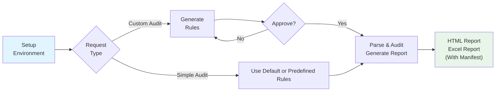

# doc-audit - A Simple Document Audit Agent Skills for Word

> Intelligent document audit system for compliance review, legal and technical document verification using LLM

[](https://opensource.org/licenses/MIT)
[](https://www.python.org/downloads/)

**doc-audit** is an LLM-powered document auditing skill for Claude that automatically reviews Word documents (.docx) for compliance violations, language accuracy, technical correctness, and logical inconsistencies. Built on the [Agent Skills](https://agentskills.io/specification) specification.

## Features

- 🤖 **LLM-Powered Auditing** - Uses Google Gemini or OpenAI models for intelligent document review
- 📋 **Flexible Rule System** - Default rules plus customizable audit criteria
- 🎯 **Block-Level Precision** - Audits each heading section independently with full traceability
- 📊 **Interactive HTML Reports** - Filter, block false positives, and export actionable results
- ✏️ **Track Changes Integration** - Apply audit fixes directly to Word documents with revision tracking
- 🔄 **Iterative Workflow** - Refine rules, resume interrupted audits, and process large documents

## Quick Start

### Prerequisites

doc-audit skill require uv package manager setup environment for helper script to run

- **[uv](https://github.com/astral-sh/uv)** - Fast Python package installer and resolver
- Python 3.12+
- Google Gemini API key OR OpenAI API key
- Word documents created in Microsoft Word 2013+ (requires `w14:paraId` attributes)

**Install uv** (if not already installed):

```bash
# macOS/Linux
curl -LsSf https://astral.sh/uv/install.sh | sh

# Or with Homebrew (macOS)
brew install uv

# Or with pip
pip install uv
```

## Install into Claude Code

doc-audit is an [Agent Skill](https://agentskills.io/specification) that integrates with Claude Code. Choose the installation method that fits your workflow:

### Method 1: Per-Project Installation

Install doc-audit for use in a specific project:

```bash
# Copy doc-audit to your project's skill directory
mkdir -p .claude/skills
cp -r /path/to/doc-audit .claude/skills/
```

Claude Code will automatically discover the skill when working in this project.

### Method 2: Global Installation

Install doc-audit for use across all projects:

```bash
# Copy doc-audit to Claude Code's global skill directory
mkdir -p ~/.claude/skills
cp -r /path/to/doc-audit ~/.claude/skills/
```

The skill will be available in all Claude Code sessions.

### Verify Installation

After installation, start Claude Code and type:

```
/doc-audit
```

Claude should recognize the skill and display its description. Environment variables must be set up before using this skill.

## Environment Variables

### API Keys (Required - choose one)

| Variable | Description |
|----------|-------------|
| `GOOGLE_API_KEY` | Google AI Studio API key (recommended) |
| `OPENAI_API_KEY` | OpenAI API key |

> **Note:** If both Gemini and OpenAI keys are set, Gemini is used by default.

### Google Vertex AI Mode (Alternative to AI Studio)

| Variable | Required | Description |
|----------|----------|-------------|
| `GOOGLE_GENAI_USE_VERTEXAI` | Yes | Set to `true` to enable Vertex AI |
| `GOOGLE_CLOUD_PROJECT` | Yes | GCP project ID |
| `GOOGLE_CLOUD_LOCATION` | No | GCP region (default: `us-central1`) |
| `GOOGLE_VERTEX_BASE_URL` | No | Custom API endpoint for proxy |
| `GOOGLE_APPLICATION_CREDENTIALS` | No* | Path to service account JSON |

\* Not required if using `gcloud auth application-default login` or running on GCP

### Model Configuration (Optional)

| Variable | Default | Description |
|----------|---------|-------------|
| `DOC_AUDIT_GEMINI_MODEL` | `gemini-3-flash-preview` | Gemini model name |
| `DOC_AUDIT_OPENAI_MODEL` | `gpt-5.2` | OpenAI model name |
| `AUDIT_LANGUAGE` | `Chinese` | Output language for audit results |

### Custom Endpoints (Optional)

| Variable | Description |
|----------|-------------|
| `OPENAI_BASE_URL` | Custom OpenAI API endpoint (for proxies, Azure, etc.) |

### Thinking/Reasoning Configuration (Optional)

For models that support extended reasoning capabilities:

| Variable | Model | Values | Description |
|----------|-------|--------|-------------|
| `GEMINI_THINKING_LEVEL` | Gemini 3 | minimal, low, medium, high | Thinking intensity |
| `GEMINI_THINKING_BUDGET` | Gemini 2.5 | Token count (0 to disable) | Thinking token budget |
| `OPENAI_REASONING_EFFORT` | OpenAI o-series | low, medium, high | Reasoning effort level |

### OpenAI Model Compatibility

Scripts use Structured Outputs (`json_schema`), which requires:
- ✅ `gpt-4o-2024-08-06` or later
- ✅ `gpt-4o-mini` or later
- ✅ `gpt-5.x` series

Older models are **NOT supported** and will cause API errors.

## Usage Examples (Claude-Code)

### Audit Stage

#### Example 1: Basic Audit with Default Rules

Simply ask Claude to audit a document without specifying custom requirements:

```
Use doc-audit to review the following file: test.docx
```

**What happens:**

1. Claude uses default audit rules (grammar, typos, ambiguous references, etc.)
2. Parses document into text blocks
3. Runs LLM audit on each block
4. Generates `test_audit_report.html` in the same directory as the source file

✅ **Use when:** You want comprehensive document review with standard quality checks

---

#### Example 2: Custom Rules Merged with Defaults

Ask Claude to audit for specific issues while keeping default rules:

```
Use doc-audit to check if the following file contains imprecise contract terms: contract.docx
```

**What happens:**
1. Claude generates custom rules for "imprecise contract terms" using LLM

3. Presents all rules for your confirmation:
   ```
   [R001] Check for vague or ambiguous monetary amounts
   [R002] Check for unclear time specifications
   ...
   [R025] Check for imprecise payment terms
   Total: 25 rules
   ```

4. After you approve, proceeds audit with custom rules and default rules

✅ **Use when:** You have domain-specific requirements but still want general quality checks

---

#### Example 3: Custom Rules ONLY (No Defaults)

Explicitly request audit with ONLY your specific rules, excluding defaults:

```
Use doc-audit to ONLY check if the following file contains imprecise contract terms (do not include default rules): contract.docx
```

**What happens:**
1. Claude generates rules with `--no-base` flag (excludes defaults)
2. Presents ONLY your custom rules for confirmation:
   ```
   [R001] Check for imprecise payment terms
   [R002] Check for ambiguous delivery clauses
   Total: 2 rules
   ```
3. After approval, proceeds with targeted audit

✅ **Use when:** You want laser-focused audit on specific criteria without noise from other checks

---

#### Example 4: Multiple Predifined Rule Sets

Use multiple rule files together for comprehensive audits:

```bash
use bidding_rules and global_rules to audit the following file: test.docx
```

**What happens:**
1. All specified rule files are merged (duplicate rule IDs will cause an error)
3. Rule files are searched in this order:
   - Exact path (if absolute or relative path provided)
   - Current working directory
   - `skills/doc-audit/assets/` directory
3. Default rules are automatically included unless ONLY is specified in your request

✅ **Use when:** You have domain-specific rule files (e.g., bidding documents, technical specifications) that you want to combine with default rules

#### Audit Stage Workflow



### Apply Stage

#### Apply Directly

After the audit stage completes, you can apply audit results to the document.

```
Apply audit result to Word directly
```

Claude Code will apply revisions and comments to the original Word document based on the audit results. The output is saved to a new document with `_edited` suffix, preserving the original file.

#### Apply With HTML Report Exported

1. Open the HTML report in a browser and review findings
2. Mark false positives as "blocked" using the UI controls
3. Export the filtered results to JSONL
4. Ask Claude Code to apply only the exported issues:
   ```
   Apply the exported audit results from exported_issues.jsonl to reviewed.docx
   ```

You can run the script provide by doc-audit to apply fixes and comments directly to Word document without bothering to ask Claude Code：

```bash
source ./.claude-work/doc-audit/env.sh
$DOC_AUDIT_SKILL_PATH/cripts/apply_audit_edits.py exported_issues.jsonl -o reviewed.docx
```

> The original Word file location is embedded in exported_issues.jsonl.

## Global Rules (Cross-Reference Verification)

Global rules perform cross-document consistency checks by extracting information from all sections and verifying consistency.

**What happens:**
1. **Extraction Phase**: Extracts structured data from each document section based on rule schemas
2. **Verification Phase**: Checks consistency across all extracted data (e.g., same organization name everywhere)
3. Global violations are merged with block-level violations in the report

**Global Rule Sample File:** [global_rules.json](skills/doc-audit/assets/global_rules.json)

⚠️ **Note:** Global rules must be manually created following the schema above. LLM-based rule generation (`parse_rules.py`) currently only supports block-level rules (type: `block`).

✅ **Use when:** You need to verify consistency across different sections (e.g., bidding numbers, organization names, delivery schedules)

## Word Document Best Practices

**doc-audit** is optimized for auditing long documents. During processing, the document is split by the smallest heading level into chunks that are sent to the LLM for parallel review. To ensure optimal results, follow these guidelines:

### Required

1. **Use Microsoft Word 2013 or later** to create/edit documents
   - Documents must contain `w14:paraId` attributes (auto-generated by Word 2013+)
   - Files created by LibreOffice, Google Docs, or python-docx need to be opened and saved in Word first

2. **Use proper Heading Styles** for document structure
   - Apply built-in heading styles (Heading 1, Heading 2, etc.) for all section titles
   - The script uses `outlineLvl` from styles to identify headings
   - Avoid formatting text to "look like" headings without using heading styles

### Recommended

3. **Keep headings concise** (≤200 characters)
   - Headings longer than 200 characters will be truncated with a warning

4. **Avoid excessively long sections** under a single heading
   - Ideal: ≤5,000 tokens per section
   - Maximum: 8,000 tokens (hard limit)
   - If content exceeds 8,000 tokens, the script attempts to split at short paragraphs (≤100 chars)
   - **Solution**: Add sub-headings to break up long sections
   - **Note**: Token estimation uses ~0.7 tokens/Chinese char, ~0.35 tokens/English char

5. **Include short paragraphs** (≤100 characters) in long sections
   - These serve as natural split points when automatic splitting is needed
   - Examples: "概述", "背景说明", "详细内容", "示例" etc.

6. **Keep tables manageable** in size
   - Tables exceeding ~5,000 tokens (JSON representation) will be automatically split
   - For large tables, enable **Repeat Header Rows** in Word:
     - Select header row(s) → Table Tools → Layout → Repeat Header Rows
     - This sets `w:tblHeader` attribute, allowing split table chunks to include headers

### Document Compatibility

| Source                | Compatible | Action Required                   |
| --------------------- | ---------- | --------------------------------- |
| Microsoft Word 2013+  | ✅ Yes      | None                              |
| Word Online           | ⚠️ Maybe    | Download and save in desktop Word |
| LibreOffice           | ❌ No       | Open and save in Microsoft Word   |
| Google Docs           | ❌ No       | Export to DOCX, then save in Word |
| python-docx generated | ❌ No       | Open and save in Microsoft Word   |

## Core Scripts

| Script | Purpose | Typical Usage |
|--------|---------|---------------|
| `setup_project_env.sh` | Environment setup | Run once at project start |
| `workflow.sh` | Complete audit pipeline | Recommended for most audits |
| `parse_rules.py` | Generate/refine custom rules | Claude uses automatically |
| `parse_document.py` | Extract text blocks from DOCX | Called by workflow.sh |
| `run_audit.py` | Execute LLM audit | Called by workflow.sh |
| `generate_report.py` | Create HTML report | Called by workflow.sh |
| `apply_audit_edits.py` | Apply fixes with track changes | Manual post-processing |

📖 **Detailed documentation**: See [skills/doc-audit/SKILL.md](skills/doc-audit/SKILL.md) and [skills/doc-audit/TOOLS.md](skills/doc-audit/TOOLS.md)

## Project Structure

```
doc-audit/
├── LICENSE                      # MIT License
├── README.md                    # This file
├── skills/
│   └── doc-audit/
│       ├── SKILL.md             # Skill instructions for Claude
│       ├── TOOLS.md             # Detailed tool documentation
│       ├── LICENSE.txt          # MIT License
│       ├── scripts/
│       │   ├── setup_project_env.sh      # Environment initialization
│       │   ├── parse_rules.py            # LLM-based rule generation
│       │   ├── parse_document.py         # DOCX parsing (Aspose.Words)
│       │   ├── run_audit.py              # LLM audit execution
│       │   ├── generate_report.py        # HTML report generation
│       │   └── apply_audit_edits.py      # Track changes integration
│       └── assets/
│           ├── default_rules.json        # Default audit rules
│           └── report_template.html      # Jinja2 HTML template
└── .claude-work/                         # Created by setup script
    ├── venv/                             # Python virtual environment
    ├── logs/                             # Operation logs
    └── doc-audit/
        ├── env.sh                        # Environment activation
        ├── workflow.sh                   # Audit pipeline script
        ├── default_rules.json            # Default rules (copied)
        ├── report_template.html          # Template (copied)
        ├── <docname>_blocks.jsonl        # Parsed blocks (per document)
        ├── <docname>_manifest.jsonl      # Audit results (per document)
        └── <docname>_custom_rules.json   # Custom rules (optional)
```

## Key Features

### Intelligent Rule System

- **Default Rules**: 20+ pre-configured rules for grammar, clarity, consistency
- **Custom Rules**: Natural language → LLM generates structured audit criteria
- **Iterative Refinement**: Add, remove, or modify rules through conversation
- **Smart Merging**: Automatically combines custom + default rules (unless explicitly excluded)
- **Multi-Rule Support**: Combine multiple rule files for comprehensive audits
- **Global Rules**: Cross-reference verification across document sections

### Robust Document Parsing

- **Heading-Based Splitting**: Each section becomes an auditable text block
- **Numbering Preservation**: Captures list labels (1.1, 1.2, etc.) via Aspose.Words
- **Table Support**: Embeds tables as JSON within text blocks
- **Stable UUIDs**: Uses Word's `w14:paraId` for reliable block identification

### Track Changes & Comments

- **Revision Markup**: Apply fixes as Word track changes (insertions/deletions) for easy review and acceptance
- **Diff-Based Edits**: Minimal changes calculated via diff algorithm, preserving original formatting and images
- **Comment Annotations**: Violation reasons attached as Word comments with timestamps and author attribution
- **Category-Based Authors**: Track changes grouped by rule category (e.g., "AI-grammar", "AI-semantic") for selective review
- **Conflict Detection**: Overlapping edits from multiple rules automatically fall back to comment-only mode

### Interactive Reports

- **Issue Filtering**: By severity, category, or rule ID
- **False Positive Blocking**: Mark and exclude invalid findings
- **JSONL Export**: Export non-blocked issues for programmatic processing
- **Rule Details**: View examples and explanations via modal dialogs

## Limitations

- ✅ Supports: `.docx` files (Word 2013+)
- ❌ Not supported: `.doc`, `.pdf`, `.rtf`, or other formats
- 📄 Block-level audit: No cross-section reference validation
- 🔑 Aspose.Words: Requires license for production (trial has evaluation watermark)
- 🎯 Audit quality: Depends on LLM model and rule clarity

## Development Setup

For developers who want to debug or modify the skill scripts independently:

### Manual Dependency Installation

While the environment setup script (`setup_project_env.sh`) automatically installs all dependencies, you can also install them manually for development purposes:

```bash
# 1. Setup Virtual Environment
uv venv --python 3.12 --seed
source .venv/bin/activate

# 2: Install dependencies from requirements.txt
uv pip install -r skills/doc-audit/requirements.txt

# Option: Install packages individually
uv pip install python-docx>=0.8.11
uv pip install lxml>=4.9.0
uv pip install defusedxml>=0.7.1
uv pip install jinja2>=3.1.0
uv pip install google-genai>=0.2.0  # For Gemini
uv pip install openai>=1.0.0         # For OpenAI
```

### Development Workflow

```bash
# 1. Create isolated virtual environment (optional but recommended)
python -m venv venv
source venv/bin/activate  # On Windows: venv\Scripts\activate

# 2. Install dependencies
pip install -r skills/doc-audit/requirements.txt

# 3. Set API keys
export GOOGLE_API_KEY="your_key"
# or
export OPENAI_API_KEY="your_key"

# 4. Run individual scripts for debugging
python skills/doc-audit/scripts/parse_document.py test.docx --preview
python skills/doc-audit/scripts/run_audit.py --dry-run --document blocks.jsonl --rules rules.json
```

**Note:** The `requirements.txt` file lists LLM packages as commented-out by default. Uncomment the one(s) you need for development.

### Debug with Claude Code

For MacOS or Linux user, you can add symbol link to Claude Code skill directory to debug doc-audit immediately after code modification:

```
# In root directory of this project
mkdir -p .claude/skills
ln -s skills/doc-audit .claude/skills/doc-audit
```

After installation, start Claude Code and type:

```
/doc-audit
```

Claude should recognize the skill and display its description.

## Advanced Usage

Before running the scripts below, set up the runtime environment:

**If you have previously run doc-audit via Claude Code in this directory:**

```bash
source ./.claude-work/doc-audit/env.sh
```

**If this is your first time running doc-audit in this directory:**

```bash
# Initialize the working environment using doc-audit's setup script
.claude/skills/doc-audit/scripts/setup_project_env.sh
# or
~/.claude/skills/doc-audit/scripts/setup_project_env.sh

source ./.claude-work/doc-audit/env.sh
```

### Manual Workflow Control

```bash
# Step 1: Generate custom rules
$DOC_AUDIT_SKILL_PATH/scripts/parse_rules.py \
  --input "Check for ambiguous payment terms and missing signatures" \
  --output .claude-work/doc-audit/contract_custom_rules.json

# Step 2: Review and edit rules (optional)
cat .claude-work/doc-audit/contract_custom_rules.json

# Step 3: Run complete audit pipeline
./.claude-work/doc-audit/workflow.sh contract.docx contract_custom_rules.json
```

### Resume Interrupted Audits

```bash
$DOC_AUDIT_SKILL_PATH/scripts/run_audit.py \
  --document .claude-work/doc-audit/report_blocks.jsonl \
  --rules .claude-work/doc-audit/report_custom_rules.json \
  --resume  # Skips already-audited blocks
```

### Apply Fixes to Document

```bash
# 1. Review HTML report in browser
# 2. Mark false positives as blocked
# 3. Export to JSONL
# 4. Apply edits with track changes
$DOC_AUDIT_SKILL_PATH/cripts/apply_audit_edits.py exported_issues.jsonl -o reviewed.docx
```

## Contributing

Contributions are welcome! This project follows the [Agent Skills specification](https://agentskills.io/specification).

## License

This project is licensed under the MIT License - see the [LICENSE](LICENSE) file for details.

## Related Resources

- [Agent Skills Specification](https://agentskills.io/specification)
- [Aspose.Words for Python](https://products.aspose.com/words/python-net/)
- [Google Gemini API](https://ai.google.dev/gemini-api/docs)
- [OpenAI API](https://platform.openai.com/docs/api-reference)

---

**Built with ❤️ using Claude Agent Skills**
